# Information and knowledge management

At the end of the session, students should be able to:

- Identify enterprise data and information as exploitable assets
- Structure data management in its corresponding dimensions.
- Knowing the usefulness of tools that go from data to knowledge
- To design a plan for the use of information
- To know the different tools for the management of information for decision making and knowledge

> "Data is the new oil". [Clive Humby - Mathematician]

## Use case - example 

We use as an example a company in the Agro sector called CherryTom GreenHouses S.L. which is mainly dedicated to the production of Cherry Pear Tomatoes and other varieties. It has 20 greenhouses with different characteristics and yields. The same company harvests, selects, packs and distributes the product.

## Information and data as a strategic asset

Successful companies are those able to sensitively gather internal and external information to consistently and continuously create new knowledge, spread it throughout the organisation and rapidly introduce it in the form of new products and services or features and functionalities in existing products and services.

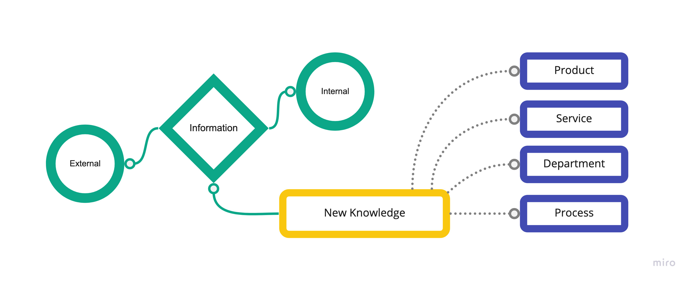

**Data strategy (definition)**

> Plan for converting data into assets to enable us to achieve a company's to achieve a company's objectives, area or department.

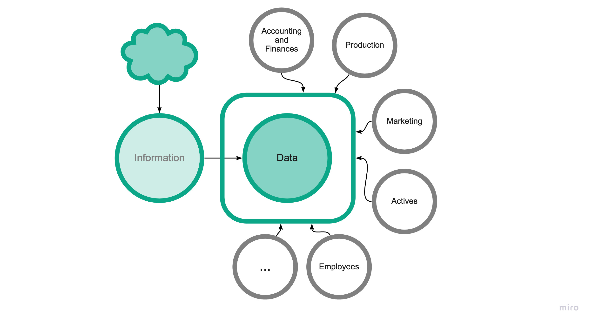

**Aligning data with "where I am going".** 

> Demonstrating that data is a strategic asset 

> Need for change in the company/area/department.

> Control and responsiveness

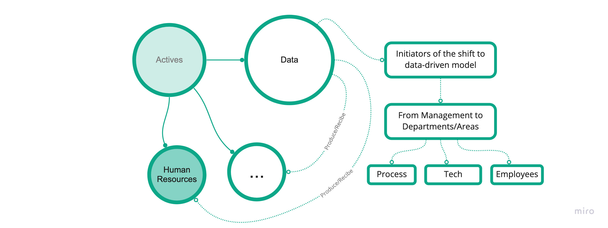

**Example of a Strategy Map**

> From data to objectives

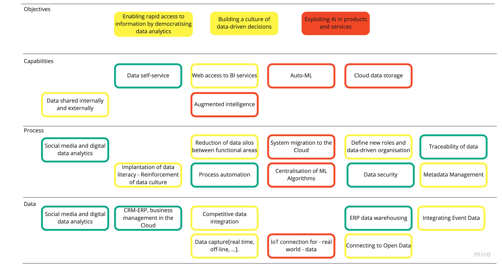

*In the last decade, the companies that have best adapted to change are those that have decided to become "Data-Driven".**

Previously, the data that companies generated were considered as by-products of the core business, mere information to be legally stored.
This data has been parked in silos (important): that is, each area or department with its data not interconnected with the rest.

Data-Driven : Exploitation of the information that companies generate (as another asset).
(as another asset)

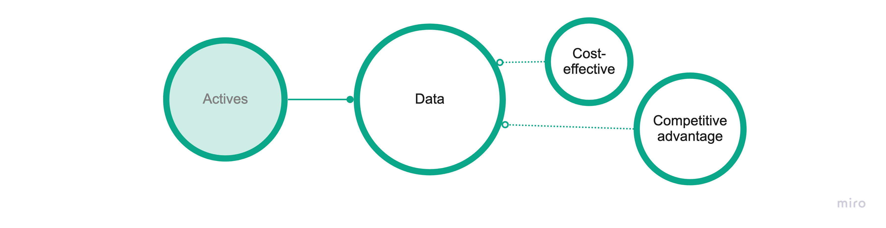

**Examples of Data Companies**

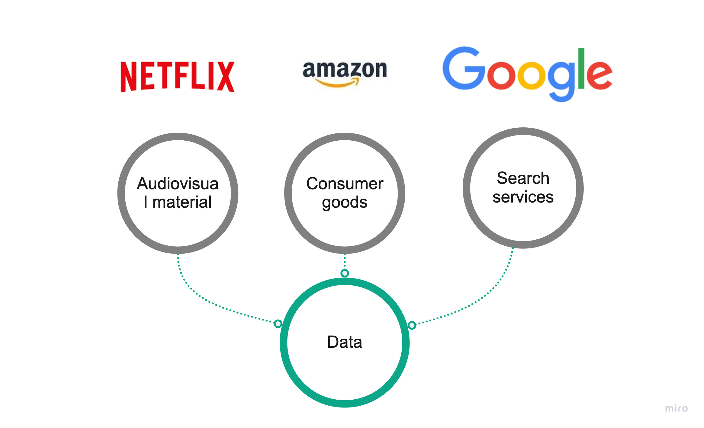

**Examples of Agro-Data-Companies**

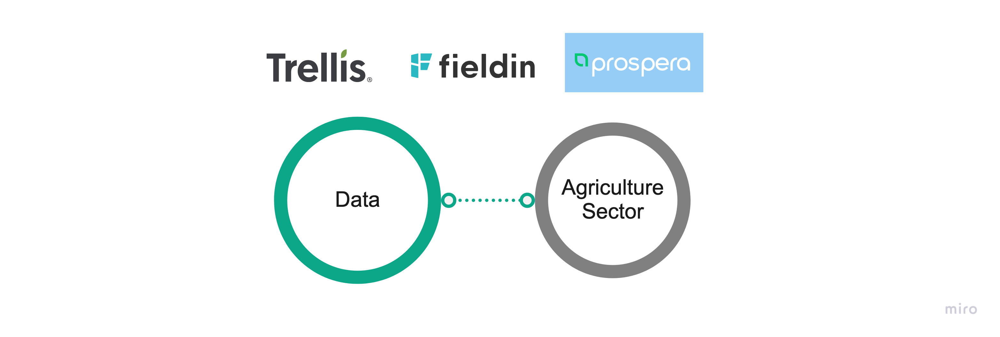

**...We all do it on a daily basis in our company.**

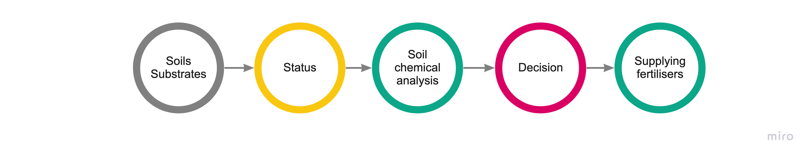

How to implement a Data-Driven model in your Agro company (example)

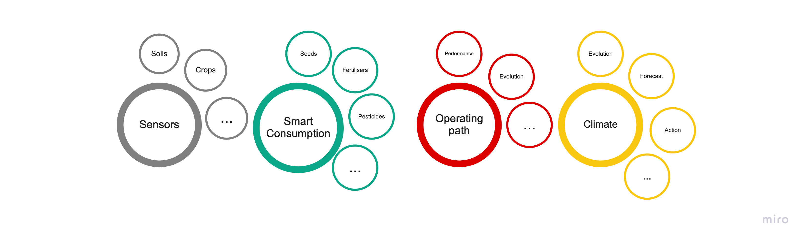

Example use case

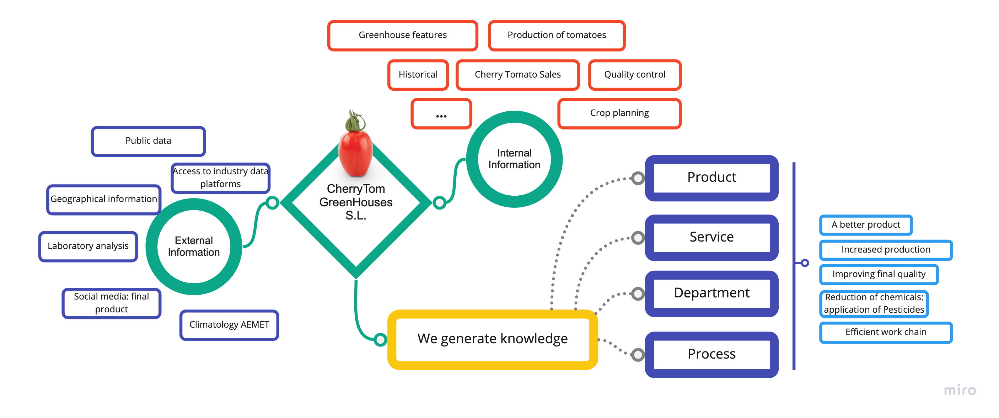

Example use case

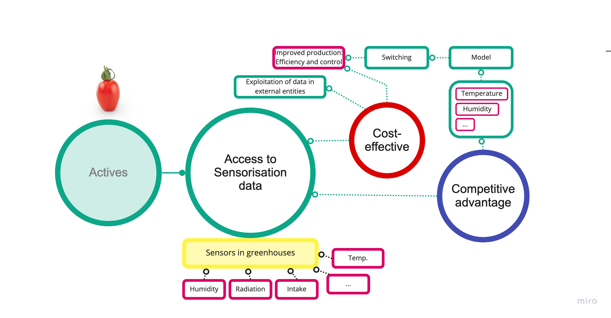

**What makes a Data-Driven company different?**

4 basic pillars

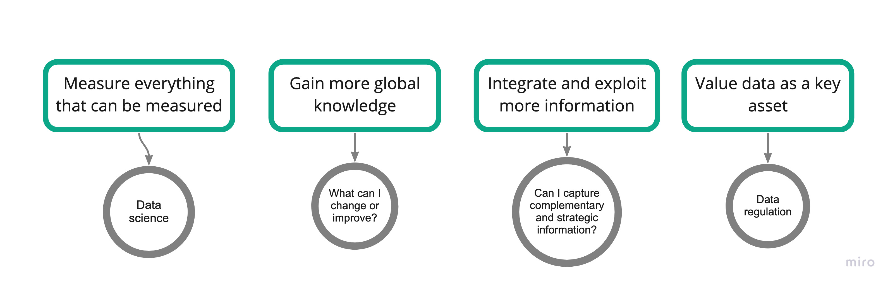

### Activity 1

**Aim:** To understand the scope of your company's information management related to Digital Transformation.

:bulb: **For this activity you will need to propose a use case or a company in order to fill in all the information.**

*In this activity we will analyse the state of information in the enterprise along with some key attributes for identifying improvements and potential information/data problems*:

- What is the scope of information your company requires?
- For what purposes is the information needed, and what is the potential impact it can have?
  - What are your objectives?
  - What objective impact could you have?
- Where does the information currently reside, and how much of it is not collected?
  - Do you use ERP, ad-hoc application, SAP,... Excel? 
  - Is there an employee intranet?
  - Which types of data are collected and which do you think are not collected?
- What part of the information affects more than one department and therefore has to be consistent and coherent?
  - Where is the information managed the worst in your company (department, area, ...).
  - Thinking about your objectives, which area of your company needs to be improved?
- What part of the information is considered strategic for your company?
  - What strategic information is aligned with your sector?

## Information management

7 most common data and information quality problems

1. Employees cannot find the data they need or the data does not exist.
2. Incorrect data
3. Unclear definition of data
4. Data security and privacy
5. Inconsistency of data from different sources
6. Too much data
7. Organisational confusion

**The cost of data status**

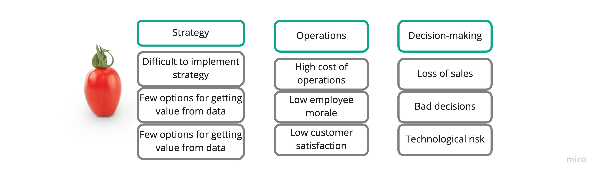

**Data monitoring**

- Active review and data evaluation check.
- The data meets minimum quality standards.
- The measurement is controlled by control panels, alerts or reports.
- It allows us to indicate quality metrics or criteria from which to make decisions about the data we have.
- DQM or Data Quality Management is required on any platform with full dependence on real-time or near real-time data.

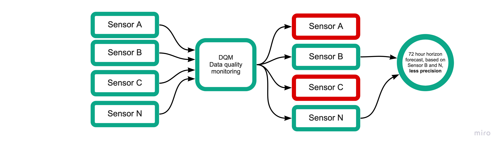

**Data dimensions**

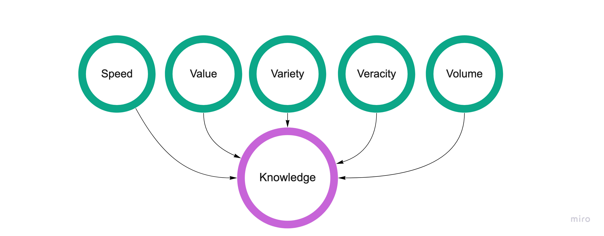

## Key factors for the effective use of information

Key questions to understand the state of information and data management in a company:

- Are there internal and external data sources to integrate?

- Is there already ICT investment related to the data environment?

- Are there staff with the skills to manage the data environment?

- Is the company's staff willing to take on board results to make decisions?

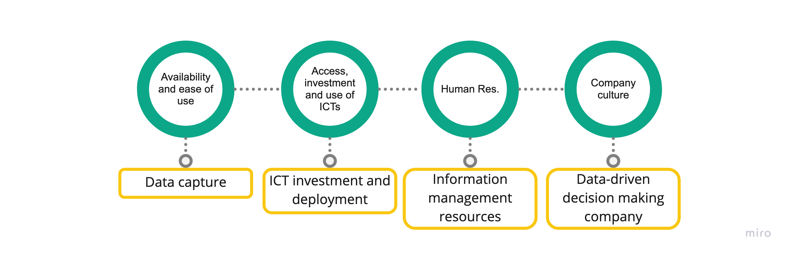

## Information management tools

- There are multiple technological solutions for information and knowledge management.
- There is an overlap between platforms and applications for this purpose.
- Even ERPs (Odoo/OpenERP, SAP BO, ....) are trying to gain market share by including functionalities for knowledge management and integrating other operations covering data analysis.
- There is no clear separation between the different solutions, but the most accepted one would be:

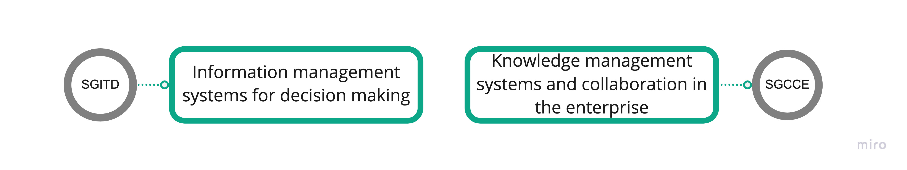

We've a complex market for information management solutions - which one to choose?

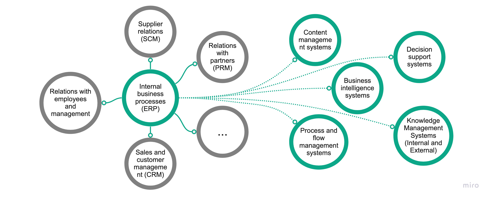

**Knowledge management and collaboration systems**

- Collaborative work and employee portals
- Communication and network collaboration
- Established workflow model
- Corporate portal introduces news, resources, applications and work environment options

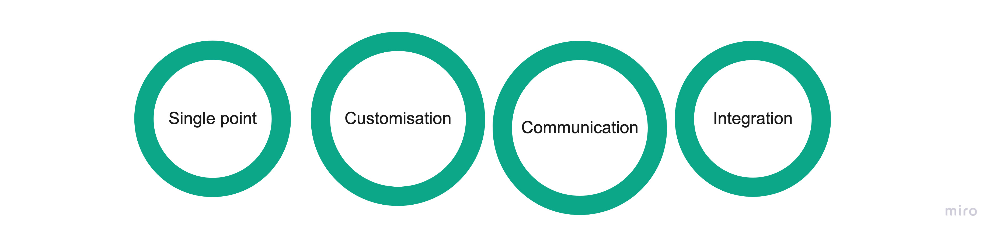

## Closing remarks

- Importance of data as an additional asset.
- If possible, measure everything or at least what is part of the objectives to be achieved.
- Need for reliable data through monitoring and quality control.
- Implementation of data management tools vital for successful information management.
- Data policies and data culture.

